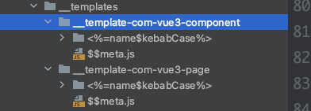

# Template Engine
基于ejs、prompt的文本/文件（代码）生成器。支持自定义本地自建模版仓库，通过`预设提示配置（prompt）`或`xlsx文件`作为数据源，结合模版，生成文件。
在ejs基础上扩展了filters能力及语法（详见Examples），支持目录模版。截止目前笔者用于以下场景：
- 生成项目（文件目录集）
- 生成代码文件（或其他形式文件）
- 根据xlsx表格生成sql脚本

#### Install

```$ npm i -g create-skcom```
```$ npm i -g create-skrepo```
```$ npm i -g create-skxlsx```

#### Features

- 新增语法，扩展了ejs的Filters能力
  - ```<%=name$camelCase%>```
- 内置常用时间处理函数
  - ```<%=$time%>```
- 模版语法可用于生成目录名，详见Examples
- 支持自定义本地模版仓库
- 支持自定义prompt提示
- 支持从xlsx中拉取数据源（下一步计划支持从数据库拉取）

#### Examples

##### filters扩展
```ejs
// 数据源 name: 'ab-ab'
// 模版及结果
<%=name$camelCase%> // abAb
<%=name$pascalCase%> // AbAb
// 其他相关过滤器：kebabCase、lowerCase、snakeCase、startCase、upperCase、capitalize、lowerFirst、upperFirst、toLower、toUpper
// 有需求欢迎来提


// 当前时间 based momentjs
<%=$time:YYYY-MM-DD%> // 2023-06-13


// 数据源：o: {a: 1, b:2}
<%=o$toJSON%> // "{"a":1,"b":2}"
```

##### 目录名生成及自定义prompt提示

模板：


提示配置 $$meta.js：

```js
export default {
  title: 'Vue3 Component',
  description: 'Vue3 TS Less Component',
  variants: [
    {
      name: 'name',
      message: '组件名称',
      default: 'sk-demo'
    },
    {
      name: 'description',
      message: '组件描述',
      default: '示例组件'
    }
  ]
}
```
执行命令
```shell
pnpm create-com
```


生成结果


##### 自定义本地模版仓库

命令执行目录下新建目录``__templates`


执行 ```pnpm create-skcom```后将读取__templates目录下的模版配置，提示选择模版后，根据$$meta.js文件进行prompt提示


...未完待续，欢迎留言


